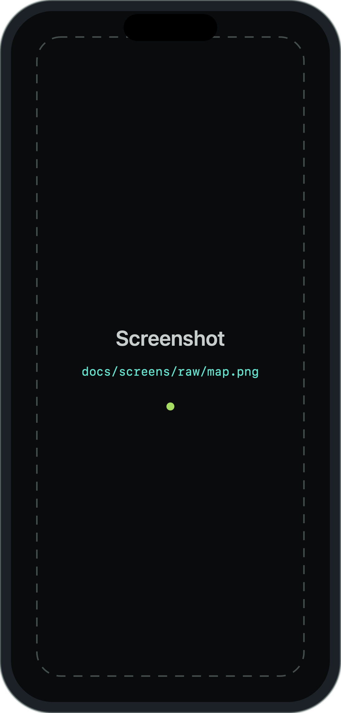
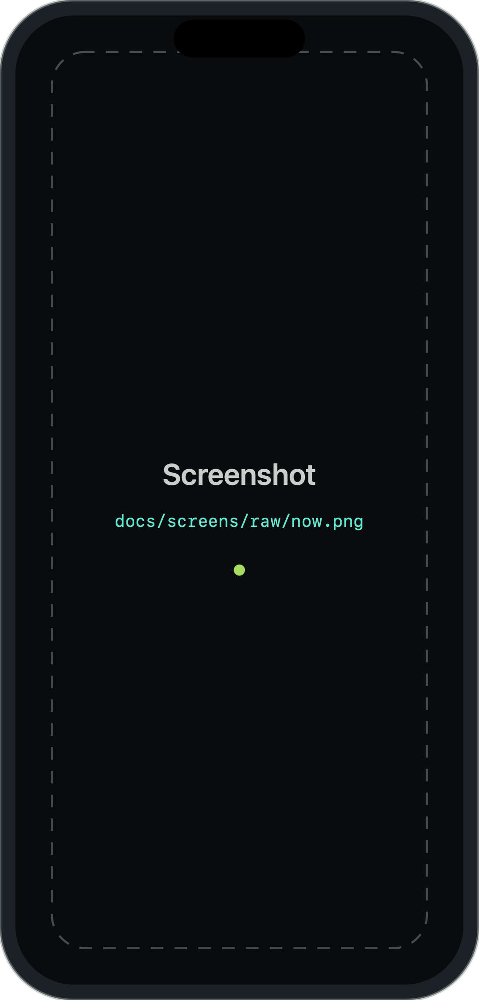
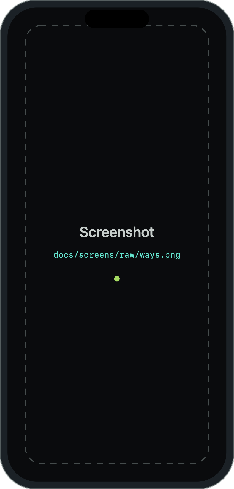
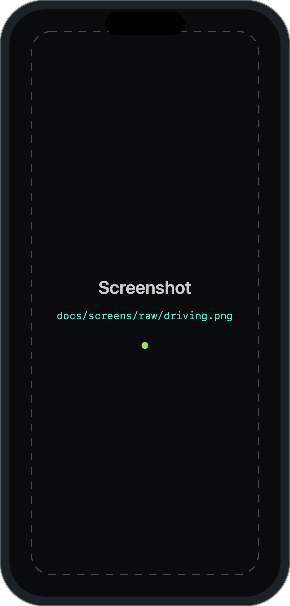

<div align="center">



<br><br>

**An iPhone app that knows where you are, what your day holds, and how to get to the next thing —
worked out on the phone itself.**

<br>


</div>

---

## The idea

Every app that knows something useful about your day keeps it in its own box. Your timetable is a
photo in your camera roll. The event is buried in an email. The place you parked is a memory. How
long it takes to get to college depends on which of four apps you ask, and none of them know that
your first class starts at 9:00.

**PathOS puts all of it on one map.** Where you are, what's next, where it is, when to leave, how
to get there, and what it costs — in one glance, without typing anything.

It is built for a particular city and a particular way of getting around: **Bengaluru**, where a
journey is rarely one thing. It is an auto to the metro, the metro across the city, and another
auto at the far end. Most travel apps will plan the middle. PathOS plans all three.

<div align="center">

</div>

---

## What it does

<!--
  Screenshots: drop full-size captures into docs/screens/raw/ named map.png, now.png, ways.png,
  driving.png and mail.png, then run `swift Tools/Screens/frame.swift`. They are placed inside the
  iPhone frame automatically; nothing below needs editing.
-->

<div align="center">



</div>

### The map is the interface

There is no home screen of tiles. There is a map with you on it, the places you have saved, the
events happening near you, and a glass deck you pull up for everything else. Two heights: closed,
or open.

### Whole journeys, door to door

Ask for any place and PathOS works out every way of getting there — straight there by road, the
metro with whatever gets you to and from the stations, a direct bus where one runs — with **each
leg's time and what it costs**.

- It boards at the station nearest you and gets off at the one nearest where you are going. Always
  those two, so the answer matches what you already know about the city.
- Auto fares follow the city's meter rates: ₹30 for the first 2 km, ₹15 per km after, one and a
  half times between 10 p.m. and 5 a.m. App fares are ranges, because they move with demand. A
  BMTC bus says the fare is paid on board rather than pretending to know it.
- The metro's own fare slabs, token and smart card, from BMRCL's published table.

### Following a way, turn by turn

<div align="center">

</div>

Pick a way and PathOS follows it. On a road leg the map hands over to MapKit's own navigation
tracking — its puck, its camera, its rotation — with the route drawn on it, the turn ahead in a
banner, spoken directions that keep playing with the screen off, and arrival time, minutes left
and distance to go along the bottom.

Falling behind is said plainly: *"12 min behind — you should be at Jayadeva Hospital by now."* The
metro leg is followed stop by stop, so you are told where to change and when to get off, and then
the map leans back in for the last leg.

### Leaving on time

For the next thing today that happens somewhere — a session at Work, or any event with a place —
PathOS works out when you would have to set off, and says so: quietly within the hour, plainly
when it is time, and clearly once you would arrive late. On the island, on the Lock Screen, and
as a notification with the app closed.

### Mail that becomes your day

<div align="center">

</div>

Connect one Gmail account or several. PathOS reads new mail **on the phone** with Apple
Intelligence, pulls out the events, deadlines and updates, and offers them for your day — you
approve each one. Priority senders come first, muted ones are counted and hidden, and every item
says which of your addresses it came to.

### A weekly schedule, from a photo

Paste your timetable or pick a photo of it, and the on-device model reads the grid: subjects,
times, rooms. Each session then appears in Day every week at your **Work** place, room first
("LH-3 · BMS College"), with a reminder before it starts.

### Spatial memory

Save where you parked, with photos and tags. Walk away, come back, and PathOS surfaces it on the
Lock Screen as you approach. Geofenced, so it costs nothing while you are away.

### A Lock Screen that keeps up

Pin the context and the Lock Screen leads with whatever matters now — the session starting in
twenty minutes, the umbrella you will want, the note you left at this spot, when to leave. Two
things at once get a card each, in full, rather than being cut down to share one.

---

## What makes it different

| | |
|---|---|
| **Everything on the phone** | The model that reads your mail and your timetable is Apple's on-device foundation model. No server sees your mail, your places or your day. |
| **It says where its numbers come from** | Rain is the middle of three forecast models, and "raining nearby" comes from a real weather station's report rather than a model's guess. Travel times say they are Apple Maps'. Fares name their source and admit when they are estimates. |
| **It never claims to know what it cannot** | No Indian metro or bus service publishes live vehicle positions, so PathOS follows *you* along the route and calls its times estimates. |
| **Built for a free Apple ID** | No push server, no CloudKit, no subscription. Alerts are scheduled on the phone; everything works offline except Apple Maps lookups. |
| **Alerts that reach you** | Urgent ones break through a Focus, are said a second time where PathOS last heard noise, and are spoken aloud while you are travelling. |

---

## Colour carries meaning

Nothing in PathOS is coloured for decoration. Every component takes a *role*, and the role decides
the colour — so a green line on the map always means you, and a cyan one never does.

<div align="center">

</div>

The same file, `Shared/PathOSPalette.swift`, is read by the app **and** by the tool that draws the
app icon, so the two can never drift apart.

---

## Your data stays yours

Everything lives on the iPhone in PathOS's own storage: places, memories and their photos, events,
the schedule, trips, mail, scans, expenses.

- Installing the app again — which a free Apple ID needs every seven days — **keeps all of it**.
- An iPhone backup carries it to a new phone.
- **Settings → Your data** writes a backup file: plain JSON with ISO dates and the photos inside,
  readable without PathOS. One is written automatically every couple of days into
  *Files → On My iPhone → PathOS*; keep a copy in iCloud Drive and nothing can be lost.
- The Google sign-in is deliberately left out of it: it lives in the keychain, on this device only.

---

## Tech stack

| Layer | What is used |
|---|---|
| **UI** | SwiftUI, iOS 26 — `Map`, Live Activities, Dynamic Island, glass effects, a deck panel drawn at every height |
| **Navigation** | MapKit: `MKDirections` for routes and turns, `MKMapView` with user tracking for the driving view |
| **Storage** | SwiftData, photos in external storage, and a JSON backup archive beside it |
| **Location** | CoreLocation — `CLLocationUpdate.liveUpdates`, geofences, significant-change wakes, background sessions |
| **Intelligence** | Apple's on-device FoundationModels, with hand-written parsers as the fallback |
| **Mail** | Gmail API over OAuth with PKCE; tokens in the keychain |
| **Weather** | Open-Meteo (ECMWF, GFS, ICON) for the forecast, aviationweather.gov METARs for what is actually happening |
| **Transit** | Namma Metro's network bundled as data; BMTC routes from a community GTFS copy |
| **Concurrency** | Swift 6 with default MainActor isolation; pure logic is `nonisolated` and tested on its own |
| **Project** | XcodeGen (`project.yml` is the source of truth), Swift Testing, and a Swift package that draws the app icon |

### How it is put together

```
PathOS/
├── App/           AppState — one observable object the whole app reads
├── Core/          Pure logic, no UI and no I/O: the part that is tested
│   ├── Logic/     DoorToDoor, TripGuide, StepGuide, LeaveOnTime, AmbientAlerts, LockScreenContext…
│   ├── Transit/   MetroNetwork, MetroRouter, BusNetwork, RoadFares
│   └── Backup/    BackupArchive
├── Services/      The outside world: location, weather, places, mail, notifications, live activities
├── UI/            World (map), Deck (Now, Day, Radar, Vault, Search), Island, Settings
└── Resources/     Bundled transit data and the generated app icons
Tools/IconForge/   Draws the app icon from PathOS_Logo.svg and the palette
Tools/Screens/     Puts README screenshots inside an iPhone frame
```

The rule: anything worth being sure about lives in `Core` as a pure function, and has a test.
**292 tests** cover the journey planner, the fare tables, lateness, the turn guide, the deck's
geometry, alert priorities and escalation, the timetable reader and the backup format.

---

## Running it

### You will need

- A Mac with **Xcode 26** or newer (this was built with Xcode 27)
- **XcodeGen** — `brew install xcodegen`
- An iPhone running **iOS 26** or newer, and any Apple ID: a free one is fine

### Steps

```bash
git clone https://github.com/Vaibhav-Reddy560/PathOS.git
cd PathOS
xcodegen generate          # PathOS.xcodeproj is generated, never edited by hand
open PathOS.xcodeproj
```

In Xcode:

1. Select the **PathOS** target, then **Signing & Capabilities**: tick *Automatically manage
   signing* and choose your Apple ID team. Do the same for **PathOSWidgets**.
2. In `project.yml`, change the three bundle identifiers to your own — `com.yourname.pathos`,
   `.widgets` and `.tests` — and run `xcodegen generate` again.
3. Choose your iPhone and press **Run**.
4. On the phone: *Settings → General → VPN & Device Management*, and trust the developer.

> On a free Apple ID the app stops launching seven days after it is installed. Install it again
> from Xcode and everything you have saved is still there: the data lives in the app's container,
> which is kept. Only deleting the app loses it, which is what the backup file is for.

### First run

Allow location — **Always**, so geofences and departure alerts work in the background — and
notifications. Then:

- **Now**: set **Home** and **Work**, by searching, by moving the map under a pin, or where you are
  standing. Most of the app keys off those two.
- **Day → Schedule**: paste your timetable, or pick a photo of it.
- **Settings → Gmail**: connect an account, if you want your mail read into your day.

### Tests

```bash
xcodebuild test -scheme PathOS -destination 'platform=iOS Simulator,name=iPhone 17'
swift test --package-path Tools/IconForge     # the icon generator has its own
```

### The app icon

Generated, not drawn — `PathOS_Logo.svg` and `Shared/PathOSPalette.swift` are the only inputs:

```bash
swift run --package-path Tools/IconForge -c release IconForge
```

It composes a night-time city map, lights the mark as glass over it, and writes the icon, the
launch mark and preview sizes. Adding `--map-detail fine --route-style none` draws the second
icon, the one with no route or pins, which can be chosen in **Settings → App icon**.

### Screenshots for this page

```bash
# put captures in docs/screens/raw/ as map.png, now.png, ways.png, driving.png, mail.png
swift Tools/Screens/frame.swift
```

Each is placed inside the iPhone frame and written to `docs/screens/`. A slot with no capture yet
shows a labelled placeholder, so the page always reads as finished.

---

## Where the data comes from

| What | Source | Licence |
|---|---|---|
| Metro stations, order, timings, fares | Wikipedia, OpenStreetMap, BMRCL's published timetable | CC BY-SA 4.0, ODbL 1.0 |
| Bus stops, routes, timetables | [bmtc-gtfs](https://github.com/Vonter/bmtc-gtfs), a community copy of BMTC's data | ODbL 1.0 |
| Forecasts | [Open-Meteo](https://open-meteo.com) — ECMWF, GFS, ICON | CC BY 4.0 |
| Station observations | [aviationweather.gov](https://aviationweather.gov) METARs | Public domain |
| Auto fares | The Bengaluru transport department's revision, via news reports | Not an official source |
| Roads, places, routing | Apple Maps | — |

Every one of these is listed inside the app, in **Settings**, beside the numbers it produces.

---

## Honest limits

- Apple Maps has no transit routing for most of India, so metro times are PathOS's own estimate
  from BMRCL's headways and the distances between stations.
- BMTC's timetables are known to be rough, and there are no live bus positions to correct them.
- Bike-taxi and cab fares move with demand: the ranges are estimates, not quotes.
- Everything is built around Bengaluru's network as it is today. The structure is general; the
  bundled data is not.

---

<div align="center">

**PathOS** · built by [Vaibhav Reddy](https://github.com/Vaibhav-Reddy560) · Bengaluru

<sub>The name is the point: an operating system for the path you are on.</sub>

</div>
