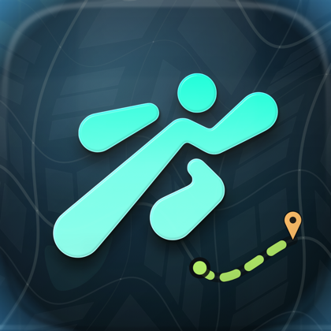
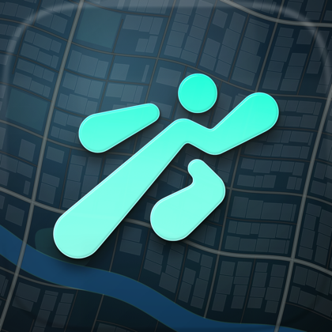

<div align="center">


<br>

**An iPhone app that knows where you are, what your day holds, and how to get to the next thing —
worked out on the phone itself.**

<br>


<br>


&nbsp;&nbsp;&nbsp;


<sub>Both icons ship with the app — switch between them in Settings. Neither is drawn by hand:
they're generated from <code>PathOS_Logo.svg</code> and the app's palette by a Swift tool in this
repository.</sub>

</div>

---

## The idea

Every app that knows something useful about your day keeps it in its own box. Your timetable is a
photo in your camera roll. The event is buried in an email. The place you parked is a memory. How
long it takes to get to college depends on which of four apps you ask, and none of them know that
your first class starts at 9:00.

**PathOS puts all of it on one map.** Where you are, what's next, where it is, when to leave, how
to get there, and what it'll cost — in one glance, without typing anything.

It's built for a specific place and a specific way of getting around: **Bengaluru**, where a
journey is rarely one thing. It's an auto to the metro, the metro across the city, and another
auto at the other end. Every travel app will plan the middle part. PathOS plans all three.

---

## What it does

<div align="center">


</div>

### 🗺 The map is the interface

There's no home screen full of tiles. There's a map with you on it, the places you've saved, the
events happening near you, and a glass deck you pull up for the rest. Two heights: closed, or open.

### 🧭 Whole journeys, door to door

Ask for any place and PathOS works out every way of getting there — straight there by road, the
metro with whatever gets you to and from the stations, a direct bus if one runs — with **each
leg's time and what it costs**.

- Boards at the station nearest you, gets off at the one nearest where you're going. Always those
  two, so the answer matches what you already know about the city.
- Auto fares follow the city's meter rates (₹30 for 2 km, ₹15/km after, 1.5× at night). App fares
  are shown as ranges because they move with demand. A BMTC bus says the fare is paid on board
  rather than pretending to know it.
- The metro's own fare slabs, token and smart card, from BMRCL's published table.

### 🚗 Following a way, turn by turn

<div align="center">

</div>

Pick a way and PathOS follows it. On a road leg the map hands over to MapKit's own navigation
tracking — its puck, its camera, its rotation — with the route drawn on it, the turn ahead in a
banner, spoken directions, and arrival time, minutes left and distance to go along the bottom.

Falling behind is said plainly: *"12 min behind · you should be at Jayadeva Hospital by now."* And
because the metro leg is followed stop by stop, you're told where to change and when to get off,
then the map leans back in for the last leg.

### ⏰ Leaving on time

For the next thing today that happens somewhere — a session at Work, or any event with a place —
PathOS works out when you'd have to set off, and says so: quietly within the hour, plainly when
it's time, and clearly once you'd arrive late. On the island, on the Lock Screen, and as a
notification with the app closed.

### 📬 Mail that becomes your day

<div align="center">

</div>

Connect one Gmail account or several. PathOS reads new mail **on the phone** with Apple
Intelligence, pulls out the events, deadlines and updates, and offers them for your day — you
approve each one. Priority senders come first, muted ones are counted and hidden, and every item
says which of your addresses it came to.

### 📅 A weekly schedule, from a photo

Paste your timetable or pick a photo of it, and the on-device model reads the grid: subjects,
times, rooms. Each session then appears in Day every week at your **Work** place, room first
("LH-3 · BMS College"), with a reminder before it starts.

### 📍 Spatial memory

Save where you parked, with photos and tags. Walk away, come back, and PathOS surfaces it on the
Lock Screen as you approach. Geofenced, so it costs nothing while you're away.

### 🔒 One Lock Screen card that keeps up

Pin the context and the Lock Screen leads with whatever matters right now — the session starting
in twenty minutes, the umbrella you'll want, the note you left at this spot, when to leave — and
changes as the day does.

---

## What makes it different

| | |
|---|---|
| **Everything on the phone** | The model that reads your mail and your timetable is Apple's on-device foundation model. No server sees your mail, your places or your day. |
| **It says where numbers come from** | Rain is the middle of three forecast models, and "raining nearby" comes from a real weather station's report, not a model's guess. Travel times say they're Apple Maps'. Fares name their source and admit when they're estimates. |
| **It never claims to know what it can't** | No Indian metro or bus service publishes live vehicle positions, so PathOS tracks *you* along the route and says the times are estimates. |
| **Built for a free Apple ID** | No push server, no CloudKit, no subscriptions. Alerts are scheduled locally; everything works offline except Apple Maps lookups. |
| **Colour carries meaning** | Aurora green is you and your actions, Ion cyan is the world PathOS finds, Amber is worth a glance, Coral is urgent. Nothing is coloured for decoration. |

---

## Your data stays yours

Everything lives on the iPhone in PathOS's own storage: places, memories and their photos, events,
the schedule, trips, mail, scans, expenses.

- Re-installing the app — which a free Apple ID needs every seven days — **keeps all of it**.
- An iPhone backup carries it to a new phone.
- **Settings → Your data** writes a backup file: plain JSON with ISO dates and the photos inside,
  readable without PathOS. One is written automatically every couple of days into
  *Files → On My iPhone → PathOS*; save a copy to iCloud Drive and nothing can be lost.
- The Google sign-in is deliberately left out of it: it's in the keychain, this device only.

---

## Tech stack

| Layer | What's used |
|---|---|
| **UI** | SwiftUI, iOS 26 — `Map`, Live Activities, Dynamic Island, glass effects, a custom deck panel drawn at every height |
| **Navigation** | MapKit: `MKDirections` for routes and turns, `MKMapView` with user tracking for the driving view |
| **Storage** | SwiftData, with photos in external storage; a JSON backup archive beside it |
| **Location** | CoreLocation — `CLLocationUpdate.liveUpdates`, geofences, significant-change wakes, background sessions |
| **Intelligence** | Apple's on-device FoundationModels, with hand-written parsers as the fallback |
| **Mail** | Gmail API over OAuth (PKCE), tokens in the keychain |
| **Weather** | Open-Meteo (ECMWF, GFS, ICON) for the forecast, aviationweather.gov METARs for what's actually happening |
| **Transit** | Namma Metro's network bundled as data; BMTC routes from a community GTFS copy |
| **Concurrency** | Swift 6 with default MainActor isolation; pure logic is `nonisolated` and tested on its own |
| **Project** | XcodeGen (`project.yml` is the source of truth), Swift Testing, a Swift package that draws the app icon |

### How it's put together

```
PathOS/
├── App/           AppState — one observable object the whole app reads
├── Core/          Pure logic, no UI and no I/O: the part that's tested
│   ├── Logic/     DoorToDoor, TripGuide, StepGuide, LeaveOnTime, AmbientAlerts, LockScreenContext…
│   ├── Transit/   MetroNetwork, MetroRouter, BusNetwork, RoadFares
│   └── Backup/    BackupArchive
├── Services/      The outside world: location, weather, places, mail, notifications, live activities
├── UI/            World (map), Deck (Now, Day, Radar, Vault, Search), Island, Settings
└── Resources/     Bundled transit data, the generated app icons
Tools/IconForge/   Draws the app icon from PathOS_Logo.svg and the palette
```

The rule: anything worth being sure about lives in `Core` as a pure function, and has a test.
**284 tests** cover the journey planner, the fare tables, lateness, the turn guide, the deck's
geometry, the alert priorities, the timetable reader and the backup format.

---

## Running it

### You'll need

- A Mac with **Xcode 26** or newer (built with Xcode 27)
- **XcodeGen** — `brew install xcodegen`
- An iPhone running **iOS 26** or newer, and any Apple ID (a free one is fine)

### Steps

```bash
git clone https://github.com/Vaibhav-Reddy560/PathOS.git
cd PathOS
xcodegen generate          # PathOS.xcodeproj is generated, never edited by hand
open PathOS.xcodeproj
```

In Xcode:

1. Select the **PathOS** target → **Signing & Capabilities** → tick *Automatically manage signing*
   and choose your Apple ID team. Do the same for the **PathOSWidgets** target.
2. In `project.yml`, change the three bundle identifiers to something of your own —
   `com.yourname.pathos`, `.widgets` and `.tests` — then run `xcodegen generate` again.
3. Pick your iPhone and press **Run**.
4. On the phone: *Settings → General → VPN & Device Management* → trust the developer.

> **On a free Apple ID**, the app stops launching seven days after it's installed. Install it again
> from Xcode and everything you've saved is still there — the data lives in the app's container,
> which is kept. Only deleting the app loses it, which is what the backup file is for.

### First run

Allow location (**Always**, so geofences and departure alerts work in the background) and
notifications. Then:

- **Now** → set **Home** and **Work** — by searching, by moving the map under a pin, or where
  you're standing. Most things key off those two.
- **Day → Schedule** → paste your timetable or pick a photo of it.
- **Settings → Gmail** → connect an account, if you want your mail read into your day.

### Tests

```bash
xcodebuild test -scheme PathOS -destination 'platform=iOS Simulator,name=iPhone 17'
swift test --package-path Tools/IconForge     # the icon generator has its own
```

### The app icon

Generated, not drawn — `PathOS_Logo.svg` and `Shared/PathOSPalette.swift` are the only inputs:

```bash
swift run --package-path Tools/IconForge -c release IconForge
```

It composes a night-time city map, lights the mark as glass over it, and writes the icon, the
launch mark and preview sizes. `--map-detail fine --route-style none` draws the map-only icon.

---

## Where the data comes from

| What | Source | Licence |
|---|---|---|
| Metro stations, order, timings, fares | Wikipedia, OpenStreetMap, BMRCL's published timetable | CC BY-SA 4.0, ODbL 1.0 |
| Bus stops, routes, timetables | [bmtc-gtfs](https://github.com/Vonter/bmtc-gtfs), a community copy of BMTC's data | ODbL 1.0 |
| Forecasts | [Open-Meteo](https://open-meteo.com) — ECMWF, GFS, ICON | CC BY 4.0 |
| Station observations | [aviationweather.gov](https://aviationweather.gov) METARs | Public domain |
| Auto fares | Bengaluru transport department's revision, via news reports | Not an official source |
| Roads, places, routing | Apple Maps | — |

Every one of these is listed inside the app, in **Settings**, next to the numbers it produces.

---

## Honest limits

- Apple Maps has no transit routing for most of India, so metro times are PathOS's own estimate
  from BMRCL's headways and station distances.
- BMTC's timetables are known to be rough, and there are no live bus positions to correct them.
- Bike-taxi and cab fares move with demand; the ranges are estimates, not quotes.
- Everything is built around Bengaluru's network today. The structure is general; the bundled data
  isn't.

---

<div align="center">

**PathOS** · built by [Vaibhav Reddy](https://github.com/Vaibhav-Reddy560) · Bengaluru

<sub>The name is the point: an operating system for the path you're on.</sub>

</div>
